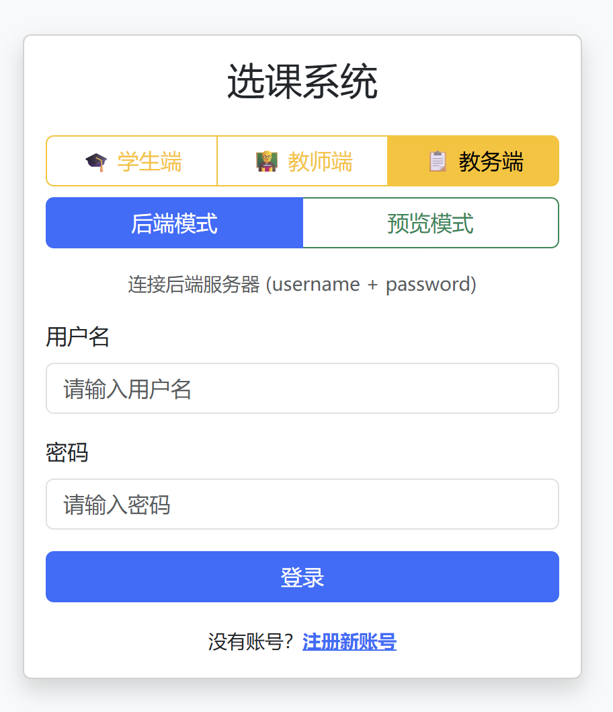
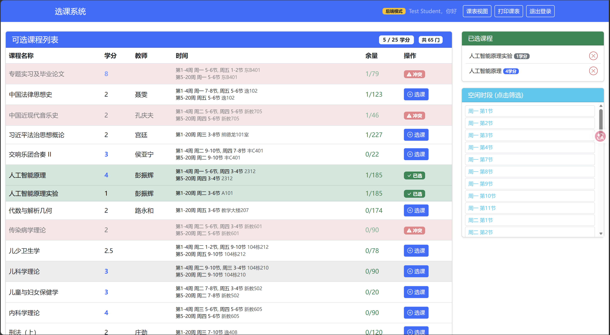
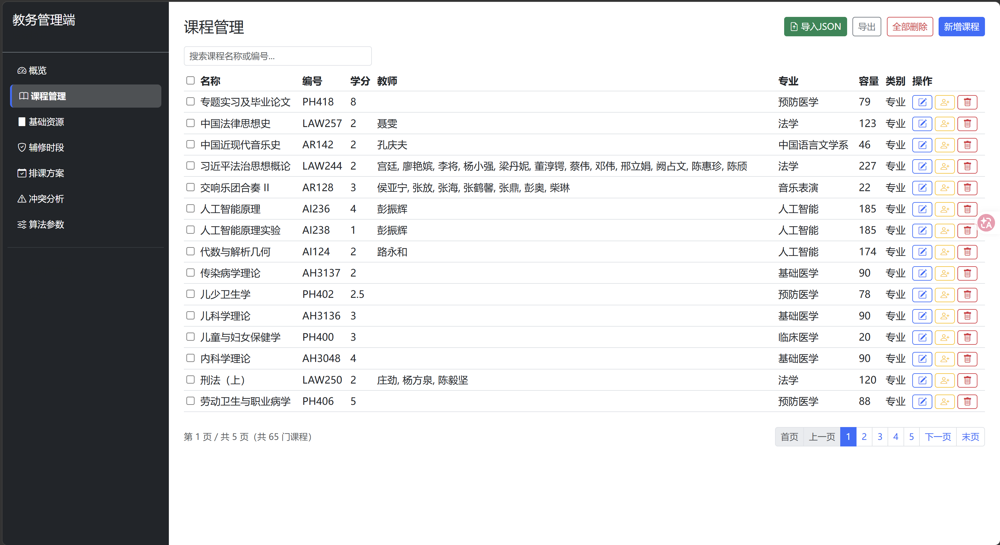
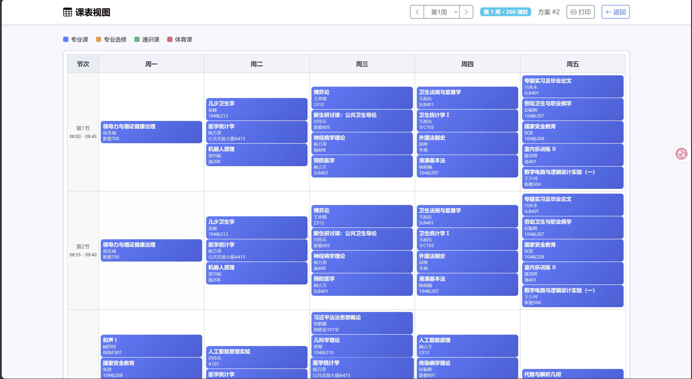

# CourseQSort

CourseQSort 是一个面向高校排课与选课场景的课程管理系统，覆盖教务管理、学生选课、教师课表、排课生成与冲突分析等核心流程。

- 前端：HTML / CSS / JavaScript
- 后端：Django + Django REST Framework
- 后端测试：`pytest` + `coverage`
- 前端测试：`Playwright`
- 持续集成：GitHub Actions

## 项目简介

本项目当前已经具备一套可运行、可测试、可持续集成的课程排课系统基础实现：

- 教务端可管理课程、教师、教室、专业、学生、班级、保护时段
- 学生端可查看课程、选课退课、查看冲突、获取空闲时段推荐
- 教师端可查看个人课表
- 系统支持排课方案生成、冲突分析、算法参数配置
- 前后端都已接入自动化测试和 CI

## 快速导航

- 前端说明：[frontend/README.md](/D:/OJ/CourseQSort/frontend/README.md)
- 后端说明：[backend/README.md](/D:/OJ/CourseQSort/backend/README.md)
- 后端 CI：`.github/workflows/backend-ci.yml`
- 前端 CI：`.github/workflows/frontend-ci.yml`

## 界面预览

### 登录页



### 学生选课页



### 教务管理页



### 排课结果 / 冲突分析页



## 仓库结构

```text
CourseQSort/
├── backend/                 Django 后端
├── frontend/                前端页面与 Playwright 测试
├── .github/workflows/       GitHub Actions CI
├── api/                     项目附带接口相关资料
├── sql/                     SQL 脚本
├── test/                    其他测试资料
├── ISSUE.md
└── ISSUE_backend_frontend_gap.md
```

## 技术栈

### 前端

- HTML / CSS / JavaScript
- Playwright

### 后端

- Python 3.13
- Django
- Django REST Framework
- SimpleJWT
- SQLite（默认开发环境）
- pytest / pytest-cov
- black / isort / flake8

## 快速开始

### 1. 启动后端

```bash
cd backend
python -m pip install --upgrade pip
python -m pip install -r requirements-dev.txt
python manage.py migrate
python manage.py runserver 8000
```

后端默认运行在：

- `http://127.0.0.1:8000/`

### 2. 打开前端

直接在浏览器中打开：

- `frontend/index.html`

当前前端登录入口是 `index.html`，不是单独的 `login.html`。

默认可先使用 Mock 模式预览，也可以切换到后端联调模式进行真实接口联调。

## 当前主要能力

- 用户认证：登录、注册、JWT 刷新、退出、当前用户信息
- 教务端：
  - 课程、教师、教室、专业、学生、班级管理
  - 保护时段管理
  - 排课方案生成、查看、发布
  - 冲突分析
  - 算法参数配置
- 学生端：
  - 课程列表查看
  - 选课 / 退课
  - 冲突详情查看
  - 空闲时段推荐
  - 个人课表查看与打印
- 教师端：
  - 教师课表查看

## API 路由概览

后端主路由当前包括：

- `api/v1/auth/`
- `api/v1/admin/`
- `api/v1/student/`
- `api/v1/teacher/`

详细接口说明请以代码和 [backend/README.md](/D:/OJ/CourseQSort/backend/README.md) 为准。

## 测试

### 后端测试

安装依赖后执行：

```bash
cd backend
python -m pytest
```

当前后端测试配置包含：

- `pytest`
- `pytest-django`
- `pytest-cov`
- 覆盖率门槛：`60%`

质量检查命令：

```bash
cd backend
python -m isort apps config manage.py --check-only
python -m black apps config manage.py --check
python -m flake8 apps config manage.py --jobs=1
python manage.py makemigrations --check --dry-run
python manage.py check
```

### 前端测试

安装依赖：

```bash
cd frontend
npm ci
```

首次本地运行如缺少浏览器：

```bash
npx playwright install chromium
```

执行端到端测试：

```bash
npm run test:e2e
```

可选命令：

```bash
npm run test:e2e:headed
npm run test:e2e:ui
```

## CI

仓库当前包含两条 GitHub Actions 工作流：

- `.github/workflows/backend-ci.yml`
- `.github/workflows/frontend-ci.yml`

其中：

- 后端 CI 负责 `isort`、`black`、`flake8`、`makemigrations --check`、`manage.py check`、`pytest`
- 前端 CI 负责 `npm ci`、Playwright 浏览器安装、`npm run test:e2e`

## 当前实现边界

这部分很重要，避免文档和代码预期不一致：

- 课程导入当前是 `JSON-only`，不是 Excel 导入
- 排课生成和冲突分析当前通过 Django 进程内线程触发，不是实际由 Celery worker 异步派发
- 仓库中虽然仍保留部分相关依赖或历史痕迹，但 README 以当前代码真实行为为准

## 开发说明

- 后端默认数据库文件为 `backend/db.sqlite3`
- 前端 Playwright 测试通过 `frontend/test-server.js` 提供静态服务
- CI 环境会单独安装 Playwright 所需 Chromium 浏览器

如果后续恢复 Excel 导入、Celery/Redis 异步任务，或新增前端框架化改造，建议同步更新根目录 README、前端 README、后端 README 三份文档。
